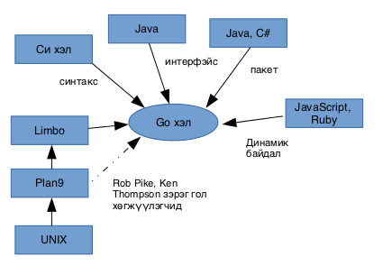

# Компютертэй ойлголцох

Компютертэй ойлголцох нь амаргүй ажил юм. Хэрэв хүмүүс бид хоорондоо ярьдаг шиг компютертэй харилцдаг бол хялбар байхсан. Гэвч энгийн хэлээр компютерт заавар өгөхөд хоёрдмол утгатай зүйлс их гарах болно. Хүмүүс олон салаа утгатай зүйлсийг ойлгодог бол компютер тийм биш,  компютер яг таг тодорхой зааврыг л ойлгоно. Тэд тоогоор "сэтгэдэг" юм. Компютерт хүний яриаг орчуулах, хөрвүүлэх шийдлүүд бий боловч хүн болон компютер хоорондоо ярилцаад бүрэн ойлголцох хэмжээнд хараахан хүрээгүй л байна.

Тэгэхээр яаж компютертэй ойлголцох вэ? Анх програм зохиогчид тоон заавраас тогтох машинд зориулсан хэлийг бүтээсэн бөгөөд энэ тоон дарааллыг компютер ойлгож гүйцэтгэдэг байв. Энэ хэл дээр бичигдсэн програм нь дараах байдалтай харагдана.

```
1010 1111
0011 0111
0111 0110
..
```

гэх мэт хэдэн зуун заавар.

Машины “тоон хэл” дээр програм бичих нь маш хүнд ажил байсан учраас хожим нь инженерүүд ассемблай хэлийг бүтээсэн. Энэ нь тоон хэлийг бага зэрэг сайжруулан нэг тоон командад нэг үг харгалзуулсан хэлбэр байв. Үүнийг ассемблай хэл гэж нэрлэсэн байна. Ассемблай хэлэнд бичсэн програм нь дараах байдалтай харагдана.

```
Ассемблай програм    Харгалзах тоон код
MOV A,47             1010 1111
ADD A,B              0011 0111
HALT                 0111 0110
...
```

гэх мэт хэдэн зуун заавар үргэлжлэнэ.


Дараа нь нэгэн програм зохиогч ассемблай програмыг машины тоон хэл рүү хөрвүүлэгч програмыг бүтээсэн байна. Уг хөрвүүлэгч програмаа _ассемблер_ гэж нэрлэсэн байна. Энэхүү ассемблер програм нь цаашдын бүх програмчлалын хэлний эхлэл байсан гэж үздэг.

Ассемблай хэлнээс улбаалан орчин үеийн олон хэл бүтээгдсэн юм. Эдгээр хэлүүд ашиглахад улам хялбар, тохиромжтой, бүтээмж өндөртэй болж програм зохиогчдын ажлыг үлэмж хөнгөвчилдөг болсон.

Орчин үеийн өндөр бүтээмжтэй хэлний нэг бол Google компаниас 2009 онд гаргасан Go нэртэй хэл юм. Go хэл нь маш энгийн бөгөөд  хүчирхэг хэл болж чадсан. Зохиомжийн хувьд програм хангамжийн инженерчлэлийн хамгийн сайн арга, туршлагуудыг агуулсан, өндөр бүтээмжтэй хэл юм.

Go хэл нь Windows, Linux, Unix, OS X зэрэг олон төрлийн платформ дээр ажиллах боломжтой байдаг нь хөгжүүлэгчдийн сонирхолыг татах нэг шалтгаан болж байна.


# Go хэлний үндэс

Go хэл нь анх 2007 онд эхлэл нь тавигдаад 2009 онд нийтэд зарлагдсан юм. Энэ хэлний цаана Google болон тэдний томоохон инженерийн баг дэмжин ажиллаж байдаг.

Багийн гишүүд нь:

* Robert Griesemer \(Java HotSpot Virtual Machine дээр ажиллаж байсан\),
* Ken Thompson \(Unix болон C хэлийг үндэслэгч, Plan 9 болон UTF-8 системийг бий болгосон\),
* Rob Pike \(Unix систем, Plan 9 төсөл, Limbo хэл зэрэг томоохон системийн үндэслэгч\).

Энэ гурван хүн бол үйлдлийн систем, програмчлалын хэл, параллел боловсруулалтын талбарт маш гүн гүнзгий мэдлэгтэй, асар арвин туршлагатай хүмүүс юм.

Go нь анхнаасаа шинэ үеийн хэл байхаар зохиомжлогдсон. Хэлний хөгжлийн хувьд C төрлийн хэлд хамаарна. Энэ төрөлд C++, Java, C\# зэрэг хэлүүд багтдаг. Мөн Pascal, Modula, Oberon хэлүүдээс ч ихээхэн нөлөө авсан байдаг. Параллел тооцоолол тал дээр Limbo, Newsqueak, Erlang хэлүүдээс зарим шинжүүдийг өвлөсөн байдаг. Товч, энгийн бичиглэл нь Javascript, Python, Ruby зэрэг скрипт хэлний шинжийг санагдуулдаг.



Go хэл нь бүрэн нээлттэй эхийн төсөл бөгөөд BSD лицензтэй байдаг. BSD лиценз нь хэн ч ашиглах, өөрчлөхөд нээлттэй, үнэ төлбөргүй байдаг. Мөн ашгийн, худалдааны зорилготой төслүүдэд ч хэрэглэж болно.

Go хэлний онцлогийг тоймлоод дүгнэвэл:

* Энгийн, хялбар: сурахад амархан
* Автомат санах ойн удирдлагатай: ашиглахад амар, алдаа багатай
* Хурдан ажиллана: хурдны хувьд C хэлтэй өрсөлдөх зорилготой
* Хурдан хөрвүүлэгч: эх кодыг хурдан хөрвүүлснээр бүтээмжийг нэмэгдүүлнэ
* Параллел боловсруулалтыг дэмжинэ
* Статик төрөлтэй
* Стандарт сангууд нь маш сайн
* Суурилуулахад хялбар: ганц машины код бүхий файл үүснэ
* Баримтжуулалт сайн
* Нээлттэй эхтэй \(BSD лицензтэй\)

